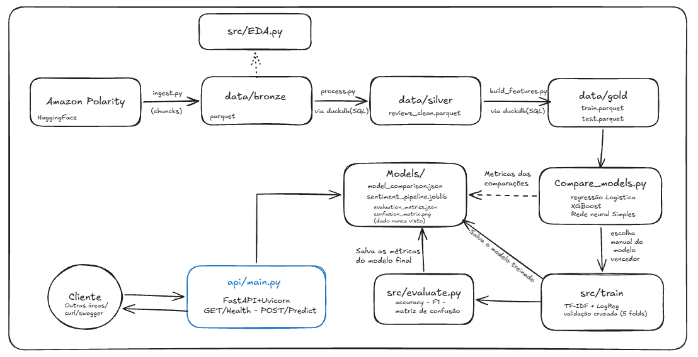
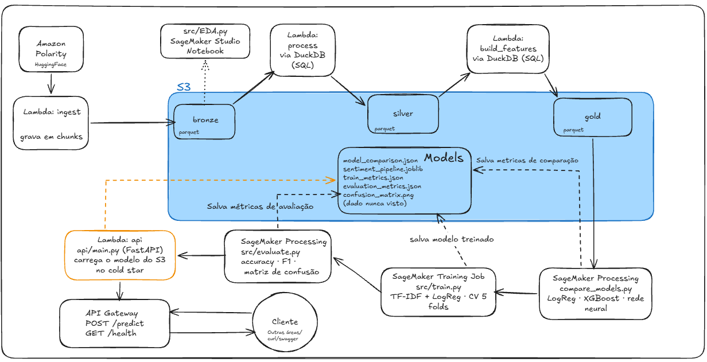
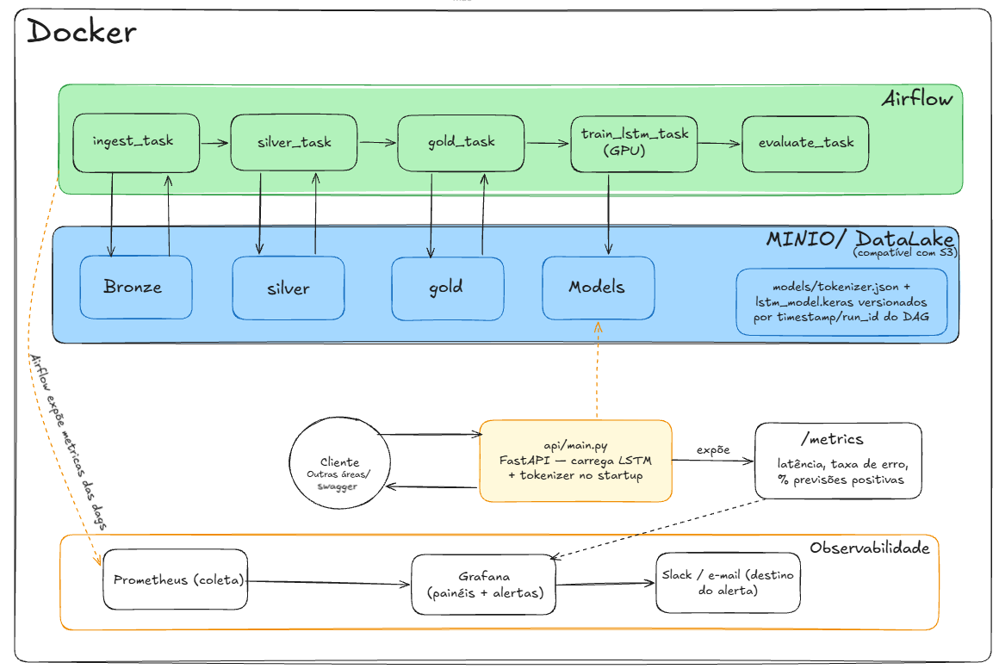

# Review Sentiment MVP

Classificacao de sentimento de reviews de produtos (positivo/negativo), disponibilizada como API interna.
Projeto construido em etapas -- cada uma so avanca depois da anterior estar funcional.

## Estrutura

```
review-sentiment-mvp/
├── data/
│   ├── bronze/
│   │   └── reviews_raw/    # dados brutos em chunks (part-0000.parquet, part-0001.parquet, ...)
│   ├── silver/              # reviews_clean.parquet: texto limpo, nulos/duplicatas removidos
│   └── gold/                # train.parquet / test.parquet: prontos para treino
├── models/         # modelo treinado serializado (.joblib)
├── notebooks/
│   ├── eda.ipynb       # mesma EDA do eda.py, com os graficos pra visualizar
│   └── evaluate.ipynb  # avaliacao do modelo com analise visual (curvas, matriz de confusao, erros)
├── src/
│   ├── ingest.py           # Bronze: baixa o dataset bruto em chunks (DuckDB/Parquet)
│   ├── eda.py              # EDA rapida sobre o Bronze via DuckDB
│   ├── process.py          # Silver: limpeza e normalizacao via SQL (DuckDB)
│   ├── build_features.py   # Gold: split treino/teste via SQL (DuckDB)
│   ├── compare_models.py   # compara Regressao Logistica, XGBoost e uma rede neural simples
│   ├── train.py            # treina o modelo escolhido e salva em models/
│   └── evaluate.py         # avaliacao final contra o test.parquet (accuracy, precision, recall, F1, matriz de confusao)
├── api/
│   └── main.py     # API FastAPI: GET /health, POST /predict (carrega o modelo em models/)
├── tests/
│   └── test_api.py # testes automatizados da API (casos positivo/negativo + validacao)
├── requirements.txt
└── README.md
```

## Dataset

O dataset usado é o `amazon_polarity` (`fancyzhx/amazon_polarity`), disponível publicamente e de graça no Hugging Face Hub, cerca de 3,6 milhões de reviews de produtos da Amazon, já rotulados como positivo ou negativo. O rótulo não foi calculado neste projeto: quem organizou o dataset originalmente derivou esse rótulo da nota em estrelas de cada review (1–2 estrelas → negativo, 4–5 estrelas → positivo; reviews de 3 estrelas foram descartados na origem, por serem ambíguos). Cada linha traz três campos: `label` (0 ou 1), `title` (título do review) e `content` (corpo do review) não há nome, e-mail ou qualquer identificador de quem escreveu, então é um dado público e sem informação pessoal.

O `ingest.py` acessa esse dataset via *streaming* (biblioteca `datasets` da Hugging Face), em vez de baixar tudo de uma vez isso permite controlar o volume baixado (`TOTAL_SAMPLES`, hoje 50 mil) sem depender do tamanho total do dataset nem precisar de uma máquina com memória suficiente pra carregar os 3,6 milhões de linhas de uma vez.

## Camadas de dados (Bronze / Silver / Gold) e chunks

O pipeline segue a arquitetura **Medallion**, um padrão comum em engenharia de dados que organiza os dados em camadas de refinamento crescente. Localmente, cada camada é só uma pasta com arquivos Parquet; em produção, cada uma viraria um prefixo de bucket S3, mantendo a mesma lógica (ver seção de arquitetura no final).

- **Bronze** (`data/bronze/reviews_raw/`): dado bruto, exatamente como vem do Hugging Face, nenhum filtro de conteúdo é aplicado aqui, só um limite de volume total (`TOTAL_SAMPLES`).
- **Silver** (`data/silver/reviews_clean.parquet`): dado limpo e normalizado (detalhes na próxima seção).
- **Gold** (`data/gold/train.parquet` e `test.parquet`): dado pronto para modelagem, já dividido em treino e teste, ainda como texto puro, sem vetorização (isso é proposital, ver seção de vetorização).

Cada seta entre camadas é um script determinístico (`ingest.py` → `process.py` → `build_features.py`), não existe transformação manual em nenhuma etapa.

O `ingest.py` grava o Bronze em **chunks**: em vez de escrever um único arquivo com todo o dado, ele escreve vários arquivos (`part-0000.parquet`, `part-0001.parquet`, ...), cada um limitado a `CHUNK_SIZE` linhas. Isso existe porque a extração é feita via streaming, o dataset nunca é carregado inteiro na memória e cada chunk é gravado em disco assim que atinge o tamanho definido. Na prática, isso limita o consumo de memória ao tamanho de um chunk, não ao tamanho do dataset inteiro, o que permite puxar o `amazon_polarity` completo (~3,6 milhões de linhas) sem estourar RAM. Tem uma vantagem extra: é exatamente assim que dados costumam existir dentro de um bucket S3 de verdade (vários objetos sob um mesmo prefixo) então a migração para nuvem fica mais direta.

`eda.py`, `process.py` e `build_features.py` usam DuckDB (SQL direto sobre os arquivos Parquet) em vez de carregar tudo num DataFrame do pandas primeiro o pipeline funciona do mesmo jeito com 20 mil ou 3,6 milhões de linhas, só muda o tempo de execução, não o código.

## Pré-processamento (Silver)

O `process.py` transforma o Bronze bruto no Silver limpo, tudo via SQL/DuckDB. As regras aplicadas, em ordem:

1. Remoção de linhas com `content` ou `label` nulos.
2. Junção de `title` + `content` num único campo `text`, tudo em minúsculas.
3. Remoção de tags HTML e de URLs.
4. Remoção de qualquer caractere fora de um conjunto básico (letras, números e pontuação comum) tira ruído/caracteres especiais.
5. Normalização de espaços em branco (múltiplos espaços ou quebras de linha viram um espaço só).
6. Deduplicação por texto exato, mantendo a primeira ocorrência de cada review idêntico.

O resultado é uma tabela com duas colunas: `sentiment` (rótulo em texto `"positive"` ou `"negative"`) e `text` (o texto limpo). Nenhuma feature numérica é criada nesta etapa, de propósito: a vetorização (transformar texto em número) só acontece dentro do treino nunca antes para não vazar vocabulário do teste para o treino.

## Vetorização: por que TF-IDF

Antes de qualquer modelo conseguir processar texto, ele precisa virar número. A técnica usada é **TF-IDF** (Term Frequency – Inverse Document Frequency), com bigramas (`ngram_range=(1,2)`) considera tanto palavras isoladas quanto pares de palavras consecutivas.

- **TF (frequência do termo)**: quanto mais uma palavra aparece num review, maior o peso dela naquele review.
- **IDF (frequência inversa nos documentos)**: penaliza palavras que aparecem em quase todos os reviews elas carregam pouca informação sobre sentimento (por exemplo, "product" ou "amazon" aparecem em quase tudo e não ajudam a diferenciar positivo de negativo).

O uso de bigramas veio direto da análise exploratória: palavras isoladas não discriminam bem sentimento (a palavra "money" aparece tanto em reviews positivos quanto negativos), mas pares de palavras como "waste money" ou "highly recommend" são muito mais informativos. TF-IDF foi escolhido em vez de uma contagem simples de palavras porque o fator IDF já resolve, de forma barata, o problema das palavras ubíquas e pouco discriminantes sem precisar montar uma lista manual de stopwords.

A vetorização é ajustada (`fit`) só dentro do pipeline de treino, e só na fatia de treino nunca sobre o dado inteiro antes do split para não vazar vocabulário do teste para o treino, nem entre os folds da validação cruzada.

## Modelo de Machine Learning

O modelo final é **TF-IDF + Regressão Logística**, encapsulados num único `Pipeline` do scikit-learn (salvo em `models/sentiment_pipeline.joblib`).

Essa escolha não foi arbitrária veio de uma comparação real entre três candidatos (`compare_models.py`), todos alimentados com a mesma vetorização TF-IDF, para isolar o algoritmo como única variável: Regressão Logística, XGBoost e uma rede neural simples (TensorFlow/Keras — uma camada oculta de 64 neurônios). Resultado com dado real:

| Modelo | Accuracy | F1-macro |
|---|---|---|
| Regressão Logística | 0,893 | 0,893 |
| Rede neural (Keras) | 0,886 | 0,886 |
| XGBoost | 0,856 | 0,856 |

A Regressão Logística venceu, e a explicação é consistente com o que a literatura já documenta: modelos baseados em árvore (como XGBoost) costumam ter dificuldade em espaços de features esparsos e de alta dimensão exatamente o que o TF-IDF produz, enquanto modelos lineares lidam bem com esse tipo de espaço. A rede neural chegou perto, mas empatando tecnicamente com um modelo muito mais simples, mais rápido de treinar e mais fácil de manter. Entre dois modelos com desempenho equivalente, o mais simples reduz custo operacional sem abrir mão de qualidade essa foi a lógica da escolha: não o modelo mais sofisticado, e sim o modelo mais simples que resolve o problema com a qualidade necessária.

## Métricas de avaliação

Duas camadas de métricas são usadas, em momentos diferentes do pipeline:

**Na comparação de modelos e na validação cruzada** (`compare_models.py`, `train.py`): accuracy e F1-macro. Fazem sentido aqui porque a análise exploratória confirmou que as classes (positivo/negativo) estão razoavelmente balanceadas nesse cenário, accuracy é uma métrica confiável (ela só engana quando há desbalanceamento forte). F1-macro complementa dando peso igual às duas classes, então nenhuma métrica de comparação favorece silenciosamente a classe maior.

**Na avaliação final contra dado nunca visto** (`evaluate.py`, contra `test.parquet`): além de accuracy e F1-macro, calcula-se precision e recall por classe, e a matriz de confusão. Esse detalhamento extra importa porque, na prática de negócio, errar pra um lado ou pro outro tem custo diferente deixar passar um review negativo sem sinalizar tem um custo diferente de marcar por engano um review positivo como negativo. Métricas agregadas escondem esse tipo de trade-off; o detalhamento por classe é o que de fato orienta uma decisão de negócio em cima do modelo.

Resultado real da avaliação final: accuracy e F1-macro de 0,904, com precision/recall equilibrados entre as duas classes (negativo: 0,90/0,90; positivo: 0,91/0,90) consistente com a validação cruzada do treino (~0,90), o que indica que o modelo generaliza e não decorou o dado de treino.

## Como rodar

1. `python -m venv .venv && source .venv/bin/activate` (Windows: `.venv\Scripts\activate`)
2. `pip install -r requirements.txt`
3. `python src/ingest.py` — baixa a amostra do dataset (precisa de internet, baixa do Hugging Face Hub). `TOTAL_SAMPLES` no topo do arquivo controla o volume (`None` = dataset inteiro).
4. `python src/eda.py` — checa balanceamento, nulos, duplicatas e tamanho dos reviews antes de limpar (ou abra `notebooks/eda.ipynb` pra ver com graficos)
5. `python src/process.py` — gera o Silver (texto limpo, rotulo padronizado, sem nulos/duplicatas)
6. `python src/build_features.py` — gera o Gold (split treino/teste)
7. `python src/compare_models.py` — compara três candidatos (Regressão Logística, XGBoost, uma rede neural simples via TensorFlow/Keras), todos com a mesma vetorização TF-IDF, num holdout 80/20 tirado do treino. Salva o resultado em `models/model_comparison.json`.
8. `python src/train.py` — roda validação cruzada (5 folds, só sobre o treino) e treina o modelo final (hoje: TF-IDF + Regressão Logística — venceu a comparação da etapa anterior com dado real), salvando em `models/sentiment_pipeline.joblib` e as métricas em `models/train_metrics.json`.
9. `python src/evaluate.py` — avaliação final: roda o modelo salvo contra o `test.parquet` (nunca visto em nenhuma etapa anterior), calcula accuracy, precision/recall/F1 por classe e a matriz de confusão. Salva em `models/evaluation_metrics.json` e `models/confusion_matrix.png`. Uma versão em notebook, com mais análise visual (curva de aprendizado, curva ROC, exemplos de erro), está em `notebooks/evaluate.ipynb`.
10. `uvicorn api.main:app --reload` — sobe a API. Docs interativas em `http://127.0.0.1:8000/docs`. `GET /health` confirma se o modelo carregou; `POST /predict` com body `{"text": "..."}` devolve `{"sentiment": "...", "confidence": ...}`.
11. `pytest tests/test_api.py -v` — roda os testes automatizados da API (casos positivo/negativo claros + validação de texto vazio/campo faltando). Não precisa da API estar no ar numa porta — o teste sobe a aplicação em memória.

## Arquitetuea local do projeto



## Arquitetura (Medallion local -> AWS)



Desenhei essa arquitetura mantendo a mesma lógica do pipeline local, só trocando cada peça por um serviço gerenciado que cobra por uso. Passo a passo:

Ingestão: uma função Lambda (ingest) baixa o dataset Amazon Polarity do Hugging Face e grava em chunks dentro do bucket S3, na camada bronze, em Parquet.

EDA: em paralelo, analiso o bronze num notebook do SageMaker Studio, só ligo quando preciso, não fica rodando o tempo todo.

Processamento (Silver): outra Lambda (process) limpa o texto via SQL com DuckDB, direto em cima do Parquet no S3, e grava o resultado na camada silver.

Preparação pra modelagem (Gold): uma terceira Lambda (build_features), também via DuckDB, separa treino e teste e grava na camada gold.

Comparação de modelos: um SageMaker Processing Job roda o compare_models.py testa Regressão Logística, XGBoost e uma rede neural simples, todos com a mesma vetorização e salva as métricas de comparação em Models.

Treino final: um SageMaker Training Job roda o train.py com o modelo escolhido (TF-IDF + Regressão Logística), faz validação cruzada de 5 folds, e salva o modelo treinado em Models.

Avaliação: um SageMaker Processing Job roda o evaluate.py contra o teste nunca visto, calcula accuracy, F1 e matriz de confusão, e salva essas métricas também em Models.

Serviço: uma última Lambda (api) carrega o modelo salvo no S3 assim que é acionada pela primeira vez (cold start).

Exposição: essa Lambda fica atrás de um API Gateway, expondo POST /predict e GET /health.

Consumo: qualquer cliente outras áreas da empresa, curl, Swagger chama o API Gateway e recebe a resposta.

Tudo isso dentro de um único bucket S3 (bronze, silver, gold e os artefatos de modelo juntos), e cada peça só é cobrada enquanto está de fato trabalhando nada fica ligado esperando tráfego.

## Problema de negócio 

Imaginem uma empresa que recebe milhares de reviews de produto todo mês texto solto, sem estrutura nenhuma. Ninguém tem tempo de ler um por um. E é exatamente aí que problemas sérios passam despercebidos: um produto com defeito recorrente, uma queda de qualidade, uma onda de clientes insatisfeitos tudo isso escondido dentro de texto que ninguém está lendo.

O que eu construí resolve esse problema: um modelo que lê cada review e diz, automaticamente, se é positivo ou negativo — com 90% de acurácia, validado contra dado que ele nunca viu antes. E entreguei isso como uma API, não como um relatório, porque o objetivo não é alguém abrir uma planilha depois é qualquer sistema da empresa poder consumir esse sinal em tempo real e agir na hora: disparar um alerta, priorizar um atendimento, sinalizar um produto com problema.

E fiz tudo isso rodando localmente, sem gastar um centavo de infraestrutura de nuvem porque antes de escalar, o primeiro passo é provar que a ideia funciona.


## Outro modo de realizar esse projeto 

Vale registrar: as escolhas técnicas descritas neste até o momento README (DuckDB local, chunks, TF-IDF, Regressão Logística, execução manual dos scripts) foram pensadas para o escopo deste case específico tempo limitado, volume de dado do case, ambiente local. Pensando em um hambiente real onde os dados chegam a todo momento precisamos pensar em escalabilidade, mais times consumindo o modelo, volume de dado ordens de grandeza maior, necessidade de retraining automatizado e observabilidade contínua, várias dessas peças mudariam de forma; isso está explorado à parte,"se houvesse mais tempo" abaixo uma breve arquitetura de uma outra estrutura: 

 


Essa é a versão que desenhei pensando em "e se eu tivesse mais tempo e quisesse montar isso sem depender de nenhum provedor de nuvem específico", a mesma lógica de sempre, só que com uma stack inteiramente open-source e self-hosted.

No topo está o Airflow orquestrando tudo: um DAG único (sentiment_pipeline) encadeia cinco tasks, ingest_task, silver_task, gold_task, train_lstm_task e evaluate_task na mesma ordem de dependência que já uso localmente. A diferença é que agora cada task ganha retry automático se falhar, agendamento (por exemplo, retreino semanal) e um histórico visual de cada execução nada disso existe quando rodo os scripts na mão.

Cada task lê e escreve num prefixo do MinIO, que funciona como o meu data lake, ele expõe uma API compatível com S3, então uso os mesmos caminhos bronze/silver/gold/models que já existem localmente, só que endereçáveis por rede em vez de por disco. Os artefatos do modelo (lstm_model.keras e o tokenizer.json que o acompanha, já que a LSTM depende de um tokenizador próprio pra transformar texto em sequência) ficam versionados por timestamp/run_id de cada execução do DAG diferente do meu setup local, onde cada treino sobrescreve o anterior, aqui eu não perco o histórico.

A task de treino é a única marcada como rodando em GPU, porque troquei o modelo de Regressão Logística por uma LSTM: com 3 milhões de linhas, treinar isso em CPU não seria viável em tempo razoável.

A API (api/main.py) carrega o modelo e o tokenizer do MinIO uma única vez, no startup, e atende o cliente normalmente. Além disso, ela expõe um endpoint /metrics com latência, taxa de erro e a proporção de previsões positivas/negativas esse último é um jeito barato de perceber deriva de dado: se essa proporção mudar bruscamente, é sinal de que o texto de entrada mudou de padrão em produção.

Por fim, a camada de observabilidade: o Prometheus coleta essas métricas da API e também sinais do próprio Airflow (se cada task rodou no horário esperado, quanto tempo levou), e o Grafana lê do Prometheus pra montar os painéis e disparar alerta Slack ou e-mail quando alguma métrica sai do esperado.


